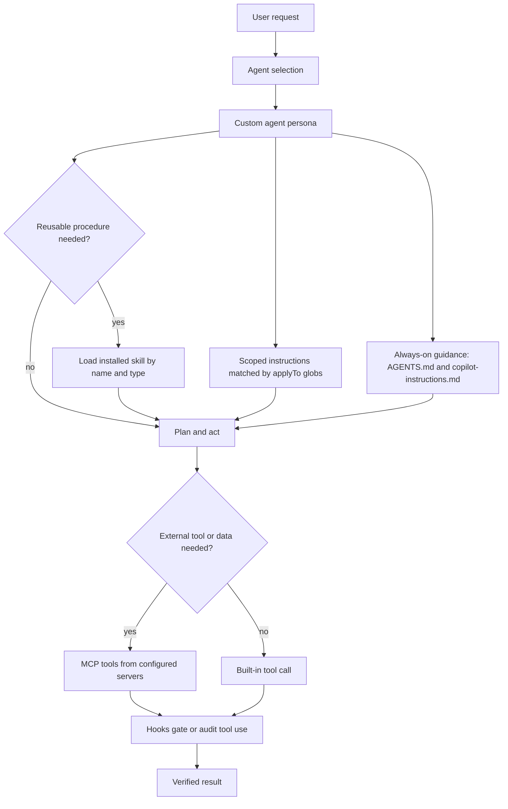

# Open Horizons GitHub Customization Map

This directory contains the repository-specific automation, governance, and Copilot customization primitives for Open Horizons. The goal is to make it clear which surface reads each file, when to choose each primitive, and how the pieces compose at runtime.

> [!IMPORTANT]
> The authoritative format contracts are [.github/docs/COPILOT-HARNESS-SPEC.md](docs/COPILOT-HARNESS-SPEC.md) and the templates in [.github/docs/templates/](docs/templates/). Validate changes with `python3 .github/skills/validation-scripts/scripts/validate-agents.py --strict`.

## Directory map

| Entry | Purpose | Primary reader |
| --- | --- | --- |
| `README.md` | This integration map for `.github/` primitives and workflows. | Humans and agents. |
| `copilot-instructions.md` | Copilot-specific repository-wide instructions that point to root `AGENTS.md`. | VS Code Copilot, Copilot CLI, Copilot cloud agent. |
| `agents/` | Custom agent personas, scope, authority, and operating procedures. | VS Code, Copilot CLI, Copilot cloud agent. |
| `skills/` | Reusable procedures and review criteria loaded on demand. | VS Code, Copilot CLI, Copilot cloud agent. |
| `instructions/` | File-scoped conventions auto-applied by `applyTo` globs. | VS Code, Copilot CLI, Copilot cloud agent. |
| `prompts/` | Focused slash-command prompt files for user-initiated VS Code actions. | VS Code only. |
| `hooks/` | Tool-use guards and audit hooks. Hook packages combine rather than override. | Copilot CLI when repository hooks are trusted. |
| `mcp.json` | Repository MCP server configuration. | Copilot CLI; VS Code can use MCP through its own configuration. |
| `docs/` | Harness evidence, primitive contracts, templates, and related documentation. | Humans, validators, and authoring agents. |
| `workflows/` | GitHub Actions workflows, including cloud-agent setup steps. | GitHub Actions; `copilot-setup-steps.yml` is used by the cloud agent. |
| `ISSUE_TEMPLATE/` | Issue forms used to route and structure GitHub issues. | GitHub Issues and repository automation. |
| `PULL_REQUEST_TEMPLATE.md` | Pull request author checklist and description template. | GitHub pull requests. |
| `dependabot.yml` | Dependency update configuration. | Dependabot. |
| `codeql/` | CodeQL query or configuration assets. | GitHub code scanning workflows. |
| `model-routing.yaml` | Repository-internal model routing convention and documentation aid. | Humans and custom automation; Copilot does not enforce it. |

## Which surface reads what

| Path | VS Code Copilot | Copilot CLI | Copilot cloud agent | Notes |
| --- | --- | --- | --- | --- |
| `AGENTS.md` at repo root | Yes | Yes | Yes | Tool-agnostic source of truth for agents. |
| `.github/copilot-instructions.md` | Yes | Yes | Yes | Copilot-specific always-on repository guidance. |
| `.github/instructions/*.instructions.md` | Yes | Yes | Yes | Auto-applied by `applyTo` glob when applicable. |
| `.github/agents/*.agent.md` | Yes | Yes | Yes | Custom personas and scope. |
| `.github/skills/<name>/SKILL.md` | Yes | Yes | Yes | Reusable procedures loaded progressively. |
| `.github/prompts/*.prompt.md` | Yes | No | No | VS Code-only. CLI and Agent Host do not discover or execute prompts. |
| `.github/mcp.json` | Via VS Code MCP configuration | Yes | No | Keep MCP assumptions explicit per surface. |
| `.github/hooks/*/hooks.json` | No | Yes | No | Hooks from all sources combine rather than override. |
| `.github/workflows/copilot-setup-steps.yml` | No | No | Yes | Cloud-agent environment setup; job must be named `copilot-setup-steps`. |
| Repo-root `.copilot/` | No | No | No | Dead location for this repository; do not put runtime config there. |

> [!WARNING]
> Nothing CLI-facing may depend on `.github/prompts/*.prompt.md`. If a prompt workflow must run in Copilot CLI or Agent Host, migrate it to a skill.

## Decision guide

| I want to ... | Use this primitive | Why |
| --- | --- | --- |
| Enforce a convention on matching files | `.github/instructions/*.instructions.md` | Instructions are passive rules that auto-apply through `applyTo` globs. |
| Package a reusable procedure, checklist, or review method | `.github/skills/<name>/SKILL.md` | Skills are loaded on demand and can include bundled resources. |
| Define a persona with judgment, scope, and authority | `.github/agents/*.agent.md` | Agents own role boundaries, decisions, allowed tools, and output posture. |
| Run a focused user-initiated action in VS Code | `.github/prompts/*.prompt.md` | Prompts are explicit VS Code slash commands and are not portable to CLI. |
| Guard, block, transform, or audit tool use | `.github/hooks/<package>/hooks.json` plus scripts | Hooks gate runtime tool events and combine across hook sources. |
| Provision external tools or data sources | `.github/mcp.json` | MCP servers expose external capabilities to compatible agent surfaces. |
| Prepare the Copilot cloud-agent environment | `.github/workflows/copilot-setup-steps.yml` | The cloud agent runs the workflow job named `copilot-setup-steps`. |
| Explain the whole repository to all agents | `AGENTS.md` at repo root | It is tool-agnostic and read by Copilot plus other agentic tools. |

## Composition flow



Prompts are intentionally not in the CLI path above. In VS Code, a user can start with a prompt file, but Agent Host and Copilot CLI workflows must use an agent or skill instead.

## Tool vocabulary: why agent `tools` lists look redundant

Custom agent `tools` frontmatter is intentionally authored as the union of VS Code and Copilot CLI vocabularies. Both surfaces silently ignore tokens they do not recognize, so a list can be valid for both surfaces while looking redundant.

| Capability | VS Code token | Copilot CLI token | Portable? |
| --- | --- | --- | --- |
| Read files and workspace context | `read` | `read` alias or `view` | Yes, `read` works on both surfaces. |
| Search code | `search` | `grep`, `glob` | Use the union: `search`, `grep`, and `glob`. |
| Edit files | `edit` | `edit` alias, plus `create` when needed | Yes, `edit` works on both surfaces for edits. |
| Execute commands | `execute` | `execute` alias or `bash` family | Yes, `execute` works on both surfaces. |
| Delegate to agents | `agent` | `agent` alias or `task` family | Yes, `agent` works on both surfaces. |
| Fetch web content | `web` or `web/fetch` | `web_fetch` | Use the union: `web` and `web_fetch`. |
| Search the web | `web` | `web_search` | Use the union: `web` and `web_search`. |

> [!WARNING]
> Removing `search` breaks VS Code search capability. Removing `grep` or `glob` breaks Copilot CLI search capability. Neither surface reports this as an error; capability silently disappears. This is the most dangerous failure mode in this harness.

The common portable pattern for read, search, edit, and execute agents is:

```yaml
tools:
  - read
  - search
  - edit
  - execute
  - grep
  - glob
```

VS Code consumes `read`, `search`, `edit`, and `execute`. Copilot CLI consumes `read`, `edit`, `execute`, `grep`, and `glob`; `search` is a CLI no-op but is covered by `grep` and `glob`.

Do not copy VS Code prompt tool IDs such as `search/codebase`, `search/usages`, `read/problems`, `read/terminalLastCommand`, `web/fetch`, or `vscode/askQuestions` into CLI-relevant agent frontmatter. Do not copy CLI-native names such as `grep`, `glob`, `web_fetch`, or `web_search` into VS Code prompt frontmatter unless that exact tool ID exists in the VS Code tool picker. Prompts and agents use different tool vocabularies.

Measured CLI behavior is documented in [Copilot harness specification section 1.3](docs/COPILOT-HARNESS-SPEC.md#13-tools-vocabulary). The validator enforces this through rule AG017: `search` is an error only when `grep` and `glob` are absent; `web` is an error only when `web_fetch` and `web_search` are absent.

## Precedence and composition rules

- Agents: user-level `~/.copilot/agents/` wins over project `.github/agents/` on filename collision. This is the inversion to remember.
- Skills: project `.github/skills/` wins over personal skills of the same name.
- MCP: project configuration wins over user configuration when both define the same server name.
- Hooks: hook sources combine; they do not override each other. Repository hooks require a trusted folder in automated CLI contexts.
- Instructions: repository-wide and matching path-specific instructions combine. Keep them focused because no deterministic merge order should be relied on.
- Prompts: `.github/prompts/*.prompt.md` are VS Code-only. Convert a cross-surface prompt workflow into a skill.
- References: reference other primitives by installed name and type, such as "use the `validation-scripts` skill." Do not use relative links between primitives because installation paths differ. Relative links are valid only for files bundled inside the same skill.
- Tool vocabulary: agent `tools` lists deliberately combine VS Code tool sets and Copilot CLI tool names when an agent must work on both surfaces.
- Prompt tools are VS Code tool IDs, a different vocabulary. Never copy prompt `tools` into agent frontmatter or CLI-native agent tokens into prompt frontmatter.

## Current inventory

| Primitive | Verified count |
| --- | ---: |
| Agents | 9 |
| Prompts | 9 |
| Skills | 29 |
| Instruction files | 10 |
| Hook packages | 8 |
| Workflows | 13 |
| MCP servers | 6: `mcp-ecosystem`, `github`, `microsoft-docs`, `azure`, `terraform`, `playwright` |
| Issue forms | 27 |

## Validation

Run the single strict validation command after changing Copilot primitives or their contracts:

```bash
python3 .github/skills/validation-scripts/scripts/validate-agents.py --strict
```

## References

- [Copilot harness specification](docs/COPILOT-HARNESS-SPEC.md)
- [Primitive templates and composition rules](docs/templates/)
- [Root agent guide](../AGENTS.md)
