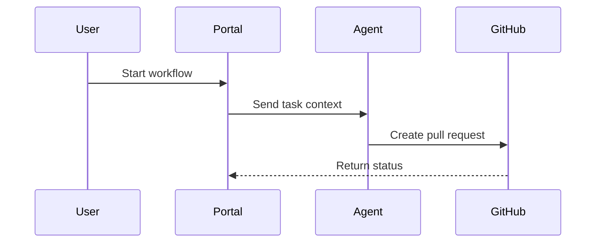

# FigJam Diagrams

Create professional Mermaid diagrams that render reliably in FigJam and follow Microsoft enterprise visual standards.

## When to Use

Use this skill when the user asks for:

- Architecture diagrams.
- Process flows.
- Sequence diagrams.
- Agent handoff flows.
- SDLC or deployment diagrams.
- Entity relationship diagrams.

## Rendering Rules

### Flowcharts

- Declare all nodes and edges before style declarations.
- Use individual `style` declarations after the graph body.
- Avoid `classDef` with `fill` in flowcharts because FigJam can render filled nodes incorrectly.
- Keep node labels under 30 characters when possible.
- Keep edge labels short and action-oriented.

### Sequence Diagrams

- Use `rect rgba(R,G,B,0.15)` for lightweight color bands.
- Keep participants named after systems or roles.
- Prefer short messages that describe observable actions.

## Microsoft Color Palette

| Purpose | Color | Hex |
|---------|-------|-----|
| Primary action | Blue | `#0078D4` |
| Planning or warning | Yellow | `#FFB900` |
| Success or test | Green | `#107C10` |
| Security or critical path | Red | `#E81123` |
| Observability | Teal | `#008272` |
| AI or modernization | Purple | `#5C2D91` |
| Human approval | Orange | `#D83B01` |

## SDLC Mapping

| Phase | Color | Agent or Role |
|-------|-------|---------------|
| Plan | Yellow | Architect / Compass |
| Code | Blue | Developer / Copilot |
| Test | Green | Test / Sentinel |
| Secure | Red | Security |
| Monitor | Teal | SRE |
| Modernize | Purple | Platform / Architect |
| Approve | Orange | Human reviewer |

## Flowchart Template

## Sequence Template

## Quality Checklist

- [ ] Diagram is in English.
- [ ] Nodes and edges are declared before style lines.
- [ ] Colors follow the Microsoft palette.
- [ ] Labels are concise and readable.
- [ ] The diagram has fewer than 20 nodes, or it is split into multiple views.
- [ ] No fill-based `classDef` styling is used in flowcharts.
