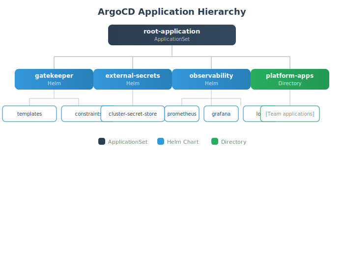

# ArgoCD Configuration

This directory contains ArgoCD application manifests and configuration for GitOps-based deployments.

## Directory Structure

```text
argocd/
├── app-of-apps/
│   └── root-application.yaml    # Root ApplicationSet
├── apps/
│   ├── external-secrets.yaml    # External Secrets Operator
│   └── gatekeeper.yaml          # OPA Gatekeeper
├── secrets/
│   └── cluster-secret-store.yaml # Key Vault integration
├── repo-credentials.yaml         # Repository access
└── sync-policies.yaml            # Sync policies by environment
```

## Quick Start

### 1. Install ArgoCD

```bash
kubectl create namespace argocd
kubectl apply -n argocd -f https://raw.githubusercontent.com/argoproj/argo-cd/stable/manifests/install.yaml
```

### 2. Configure Repository Credentials

```bash
# Edit repo-credentials.yaml with your GitHub details
kubectl apply -f repo-credentials.yaml
```

### 3. Deploy Root Application

```bash
kubectl apply -f app-of-apps/root-application.yaml
```

## Application Hierarchy



## Sync Policies

| Environment | Auto-Sync | Self-Heal | Prune |
|-------------|-----------|-----------|-------|
| dev | Yes | Yes | Yes |
| staging | Yes | Yes | No |
| prod | No | Yes | No |

## Configuration Notes

### Repository URL

Before deploying, update or render the repository URL placeholders:

```yaml
# Replace placeholders with your organization and repository names.
repoURL: https://github.com/GITHUB_ORG_PLACEHOLDER/GITHUB_REPO_PLACEHOLDER.git
```

For the app-of-apps flow, use these placeholders consistently:

| Placeholder | Meaning | Example |
|-------------|---------|---------|
| `${GITHUB_ORG}` | Customer GitHub organization | `contoso` |
| `${GITHUB_REPO}` | Customer fork of this repository | `open-horizons-platform` |
| `${GITOPS_REPO}` | Customer GitOps repository, if separate | `platform-gitops` |
| `${GOLDEN_PATHS_REPO}` | Golden Paths repository, if separate | `golden-paths` |

Single-repository deployments can set `${GITOPS_REPO}` and `${GOLDEN_PATHS_REPO}` to the same value as `${GITHUB_REPO}`.

### Secret Store

The ClusterSecretStore requires:

- Azure Key Vault URL
- Workload Identity configured on AKS
- Service account with federation

## ArgoCD Access

### Get Admin Password

```bash
kubectl -n argocd get secret argocd-initial-admin-secret \
  -o jsonpath="{.data.password}" | base64 -d
```

### Port Forward UI

```bash
kubectl port-forward svc/argocd-server -n argocd 8080:443
# Access at https://localhost:8080
```

### CLI Login

```bash
argocd login localhost:8080 --insecure
```

## Troubleshooting

### Application Not Syncing

```bash
# Check application status
argocd app get <app-name>

# Force sync
argocd app sync <app-name> --force

# Check events
kubectl get events -n argocd --sort-by='.lastTimestamp'
```

### Repository Access Issues

```bash
# Verify repository configuration
argocd repo list

# Test repository connection
argocd repo add https://github.com/org/repo --username user --password token
```

## Related Documentation

- [ArgoCD Documentation](https://argo-cd.readthedocs.io/)
- [Deploy Agent](../.github/agents/deploy.agent.md)
- [Deployment Guide](../docs/guides/DEPLOYMENT_GUIDE.md)
