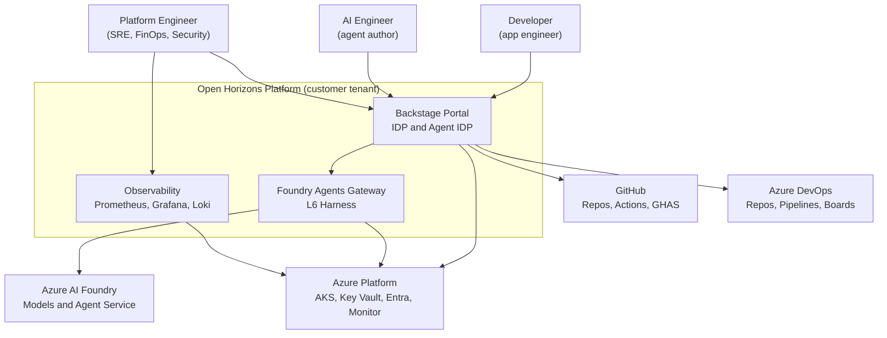
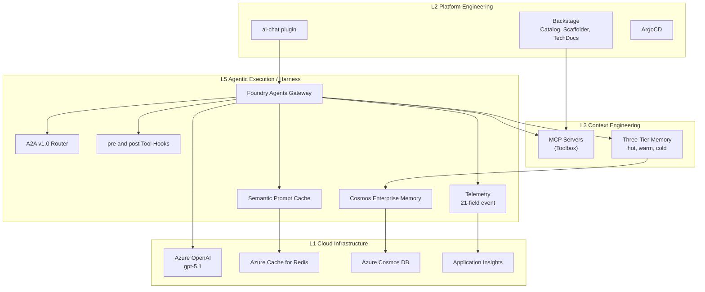
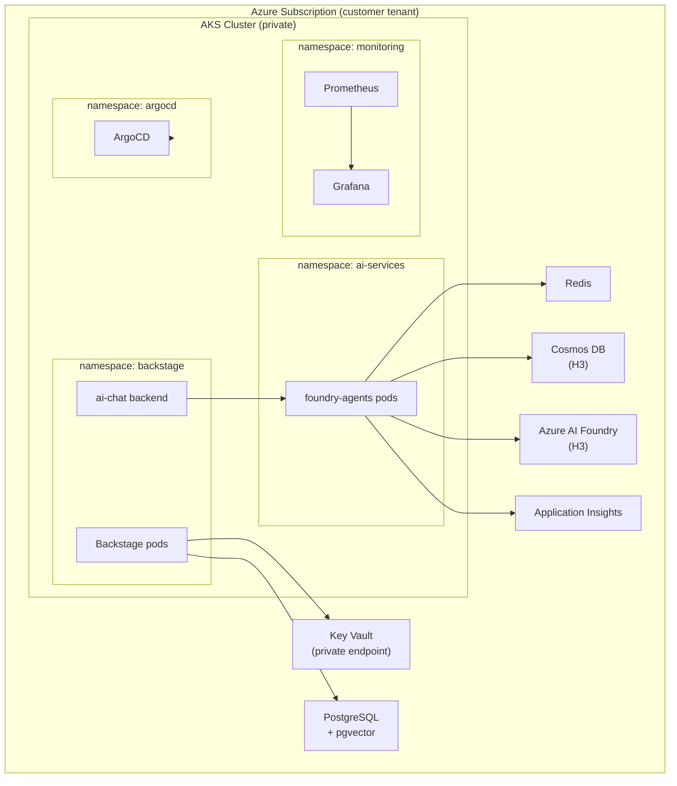
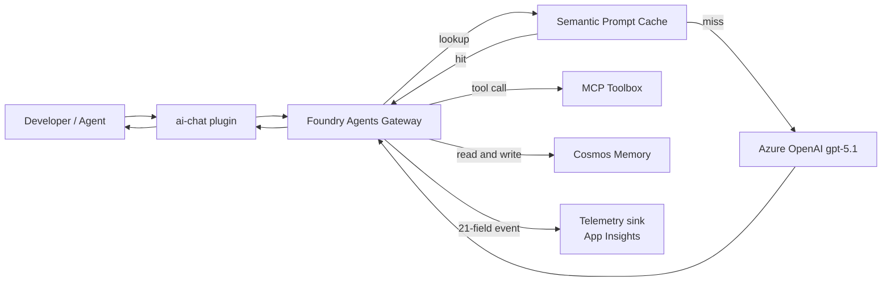
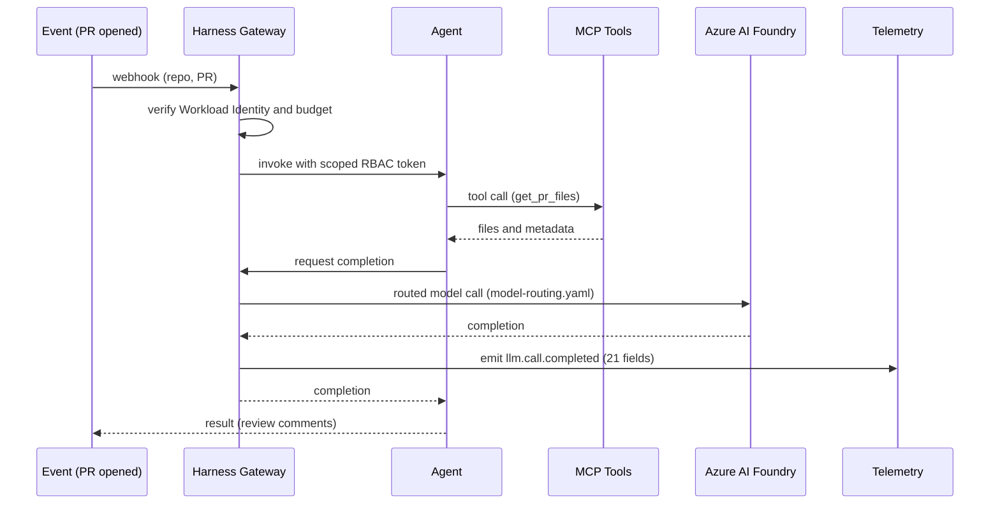

# Open Horizons Platform Architecture

> Agentic DevOps Platform: Backstage OSS on Azure AKS, the five-layer Context Platform Stack, and the H1/H2/H3 Horizons adoption arc. This document is the authoritative architecture reference and the C4 model for the platform.

| Field | Value |
| --- | --- |
| Product | Open Horizons (open-source Agentic DevOps Platform) |
| Cloud | Microsoft Azure |
| Portal | Backstage OSS |
| Runtime | Azure Kubernetes Service (AKS) |
| AI runtime | Azure AI Foundry (gpt-5.1, gpt-4o-mini, text-embedding-3-large) |
| Audience | Architects, platform leads, security, FinOps, delivery partners |

---

## Executive Summary

Open Horizons is an Azure-native accelerator that delivers a production-grade Internal Developer Platform and an AI Agent Platform in one coherent stack. It is deployed into the customer tenant, on the customer subscription, with the customer identity provider. No data leaves the tenant, and every layer is open source or an open standard.

The platform is organized as a layered Context Platform Stack and rolled out in three Horizons:

- **H1 Foundation** delivers the cloud substrate and the base portal: AKS, networking, Key Vault, PostgreSQL, observability, Backstage, and ArgoCD.
- **H2 Enhancement** delivers platform governance and integration: Golden Paths, OPA policy, DORA metrics, RBAC, and the GitHub plus Azure DevOps integration surface.
- **H3 Innovation** delivers the agent runtime: the Azure AI Foundry agents gateway (the L6 harness), three-tier memory, the MCP Toolbox, semantic prompt cache, and per-agent governance.

The architecture separates concerns into five layers so that each has an unambiguous owner, a distinct change cadence, and an independent review process. The L6 harness wraps every model call to enforce identity, cost ceilings, caching, and trajectory logging, which is the control point that turns ungoverned pilots into auditable production systems.

This document presents the five required architecture views: System Context, Component Architecture, Deployment Architecture, Data Flow, and a representative Sequence. Each view includes its diagram and a seven-part explanation. Numbers cited here are configuration defaults from the repository sizing profiles and module variables; capacity and cost numbers must be confirmed against the target subscription before sign-off.

---

## System Context

The System Context view is the C4 Level 1 picture: who uses the platform, and which external systems it depends on.

**Overview.** The platform exposes one portal to three human roles and brokers all model traffic through one gateway. Developers and agent authors self-serve through Backstage; platform engineers own the governance and observability surfaces. Every outbound dependency is an Azure or GitHub first-party service or an open standard.

**Key Components.** Backstage Portal is the single pane of glass for both developers and agents. The Foundry Agents Gateway is the L6 harness that fronts Azure AI Foundry. Observability aggregates platform and agent telemetry. GitHub and Azure DevOps are the source-control and pipeline systems. Azure AI Foundry provides inference and the Agent Service. The Azure Platform provides compute, identity, and secrets.

**Relationships.** Human roles interact only with the portal and the observability surface, never directly with model endpoints. The portal delegates all model calls to the gateway, which is the only component permitted to reach Azure AI Foundry. Integration with GitHub and Azure DevOps is mediated by the portal so the catalog stays the source of truth.

**Design Decisions.** All inference is funneled through a single gateway so identity, cost, caching, and audit are enforced in one place rather than scattered across clients. The platform is deployed inside the customer tenant to keep data residency and compliance under customer control.

**NFR Considerations.** Security is served by routing every model call through the harness with Workload Identity. Auditability is served by a single trajectory and telemetry path. Portability is served by using open standards (Kubernetes, Terraform, OpenTelemetry, MCP) at every boundary.

**Trade-offs.** A single gateway is a potential bottleneck and a single point of failure, accepted in exchange for uniform governance; it is mitigated by horizontal replicas per environment size. Funneling integration through the portal adds a hop, accepted to keep one catalog of record.

**Risks and Mitigations.** Risk: gateway outage halts agent traffic. Mitigation: multiple replicas, readiness probes, and graceful degradation to direct-with-audit mode. Risk: tenant misconfiguration exposes secrets. Mitigation: Key Vault with private endpoints and no keys in pods.

---

## Component Architecture

The Component Architecture view is the C4 Level 2 and Level 3 picture: the containers inside the platform and the internal components of the L6 harness.

**Overview.** The platform containers map to the Context Platform Stack layers. The portal and ArgoCD sit in L2, context engineering sits in L3, and the harness components sit in the agentic execution layer that wraps every model call. The harness internals (cache, A2A, hooks, telemetry, memory) are distinct components with one entry point: the gateway.

**Key Components.** Backstage hosts the catalog, scaffolder, and the ai-chat plugin. The MCP Servers expose tools to agents. Three-Tier Memory provides hot, warm, and cold context. The Foundry Agents Gateway orchestrates cache lookup, tool hooks, A2A routing, telemetry emission, and memory access. Redis backs the semantic cache, Cosmos DB backs enterprise memory, and Application Insights receives the telemetry event.

**Relationships.** The ai-chat plugin calls the gateway, never the model directly. The gateway consults the cache before inference, applies tool hooks around every tool call, routes agent-to-agent handoffs through the A2A component, and emits one telemetry event per model call. Cold memory persists to Cosmos DB.

**Design Decisions.** The harness is a separate deployable service rather than in-process middleware, so it can scale, be probed, and be audited independently of any single agent. Cache, memory, and telemetry are pluggable components behind the gateway so partners can swap backends per client.

**NFR Considerations.** Performance is served by the semantic cache reducing inference calls. Cost control is served by per-call telemetry and routing to the cost-optimal model tier. Observability is served by the single 21-field event that lands in Application Insights.

**Trade-offs.** Splitting the harness into discrete components adds internal latency versus a monolith, accepted for testability and independent scaling. A semantic cache risks stale answers, mitigated by a high similarity threshold and per-agent cache scoping.

**Risks and Mitigations.** Risk: cache poisoning returns wrong context. Mitigation: similarity threshold of 0.93 and tenant-scoped cache keys. Risk: memory store grows unbounded. Mitigation: serverless Cosmos with throughput ceiling and retention policy.

---

## Deployment Architecture

The Deployment Architecture view shows how the containers are placed onto Azure infrastructure across the H1, H2, and H3 Horizons.

**Overview.** Everything runs on a single private AKS cluster, partitioned by namespace. H1 provisions the cluster, Key Vault, PostgreSQL, and monitoring. H2 adds ArgoCD and Backstage. H3 adds the `ai-services` namespace with the foundry-agents gateway and its backing Cosmos DB and Azure AI Foundry resources.

**Key Components.** The `backstage` namespace holds the portal and the ai-chat backend. The `ai-services` namespace holds the foundry-agents gateway. The `argocd` and `monitoring` namespaces hold GitOps and observability. Key Vault, PostgreSQL with pgvector, Redis, Cosmos DB, Azure AI Foundry, and Application Insights are the Azure platform dependencies.

**Relationships.** Backstage reaches Key Vault and PostgreSQL over private endpoints. The ai-chat backend calls the gateway in the ai-services namespace. The gateway reaches Redis, Cosmos DB, Azure AI Foundry, and Application Insights. ArgoCD reconciles the cluster from Git. Prometheus feeds Grafana.

**Design Decisions.** Namespaces isolate blast radius and map to ownership; the gateway lives in `ai-services` so its identity, network policy, and quotas are independent of the portal. Cosmos DB and Azure AI Foundry are gated to H3 so H1 and H2 deploy without them.

**NFR Considerations.** Security is served by a private API server, private endpoints, and per-namespace network policy. Scalability is served by per-size replica counts in the sizing profiles. Reliability is served by readiness and liveness probes on every workload.

**Trade-offs.** A single cluster is simpler to operate but couples failure domains, accepted for cost and operational simplicity at the target scale, with namespace isolation as the mitigation. Private networking complicates partner onboarding, accepted for the security posture.

**Risks and Mitigations.** Risk: cluster-wide outage. Mitigation: multi-replica workloads, infrastructure as code for fast rebuild, and ArgoCD reconciliation. Risk: H3 resources provisioned before readiness. Mitigation: sizing flags default foundry resources to disabled until adoption.

---

## Data Flow

The Data Flow view traces a single governed model call from the developer through the harness and into telemetry.

**Overview.** A request enters through the ai-chat plugin and is handed to the gateway. The gateway checks the semantic cache; on a miss it calls the model, on a hit it returns the cached completion. Tool calls go through the MCP Toolbox, context reads and writes go to memory, and every call ends by emitting one telemetry event.

**Key Components.** The ai-chat plugin is the client. The gateway is the orchestrator. The semantic prompt cache is the first decision point. The MCP Toolbox provides tools. Azure OpenAI provides inference. Cosmos memory provides cold context. Application Insights is the telemetry sink.

**Relationships.** The cache sits between the gateway and the model. The toolbox and memory are side calls the gateway makes during a turn. The telemetry event is emitted unconditionally, whether the path was a cache hit or a model call.

**Design Decisions.** Cache lookup precedes inference so the cheapest path is tried first. Telemetry is emitted on every path so cost and trajectory data are complete. Memory reads and writes are explicit gateway operations so context is governed, not implicit.

**NFR Considerations.** Cost is served by the cache-first path and per-call accounting. Latency is served by returning cache hits without a model round trip. Compliance is served by the complete, structured telemetry record of every call.

**Trade-offs.** Always emitting telemetry adds write volume, accepted for complete auditability and mitigated by asynchronous emission. Cache-first adds a lookup on every call, accepted because the hit rate amortizes it.

**Risks and Mitigations.** Risk: telemetry sink unavailable drops audit data. Mitigation: buffered, retried emission to Application Insights. Risk: sensitive content cached. Mitigation: content classification and per-tenant cache isolation before any cache write.

---

## Sequence

The Sequence view shows the runtime ordering of a governed agent invocation, including identity and budget checks in the harness.

**Overview.** An event triggers the harness, which verifies identity and budget before invoking the agent with a scoped token. The agent calls tools, then requests a completion that the harness routes to Azure AI Foundry. The harness emits the telemetry event and returns the result.

**Key Components.** The event source is a webhook. The Harness Gateway enforces governance. The Agent executes the task. MCP Tools provide capabilities. Azure AI Foundry provides inference. The Telemetry sink records the call.

**Relationships.** The harness mediates every step: it gates the invocation, brokers the model call, and records the outcome. The agent never reaches the model or the budget controls directly.

**Design Decisions.** Identity and budget checks happen before any agent work so a denied call costs nothing. Model selection is externalized to a routing file so cost and capability trade-offs are configuration, not code.

**NFR Considerations.** Security is served by Workload Identity and scoped RBAC tokens per invocation. Cost control is served by the pre-invocation budget check. Observability is served by the single structured event per call.

**Trade-offs.** Pre-checks add latency to the first token, accepted because they prevent runaway cost and unauthorized access. Externalized routing adds a config dependency, accepted for operability.

**Risks and Mitigations.** Risk: budget check bypassed by a direct call. Mitigation: network policy permits the model endpoint only from the gateway. Risk: stale routing config selects a wrong model. Mitigation: routing file is version-controlled and validated in CI.

---

## Risks and Mitigations

| Risk | Impact | Likelihood | Mitigation |
| --- | --- | --- | --- |
| Gateway becomes a bottleneck or single point of failure | High | Medium | Horizontal replicas per environment size; readiness probes; degraded direct-with-audit mode |
| Semantic cache returns stale or cross-tenant context | High | Low | Similarity threshold 0.93; per-tenant cache keys; content classification before write |
| H3 Azure resources provisioned before readiness | Medium | Medium | Sizing flags default foundry resources to disabled; gated Terraform counts |
| Secrets exposed in pods | High | Low | Key Vault with private endpoints; Workload Identity; no keys in manifests |
| Telemetry sink unavailable drops audit records | Medium | Low | Buffered, retried asynchronous emission to Application Insights |
| Single AKS cluster couples failure domains | Medium | Medium | Namespace isolation; infrastructure as code for rapid rebuild; ArgoCD reconciliation |
| Model routing misconfiguration raises cost | Medium | Medium | Version-controlled model-routing.yaml validated in CI; per-call cost telemetry and alerts |

---

## References

- Repository program skeleton: [CODEMAP.md](../../CODEMAP.md)
- Agent system: [AGENTS.md](../../AGENTS.md)
- Foundry agents gateway: [foundry/agents-service/README.md](../../foundry/agents-service/README.md)
- Sizing profiles: [config/sizing-profiles.yaml](../../config/sizing-profiles.yaml)
- Context Platform dashboards: [grafana/dashboards/context-platform](../../grafana/dashboards/context-platform)
- Architecture decision records: [docs/architecture/adr](adr)

## Validation

Validated with the architecture-doc gate (`python .github/skills/architecture-doc/scripts/validate_arch.py docs/architecture/OpenHorizons_Architecture.md`). Update this note with the run result whenever the document changes.
