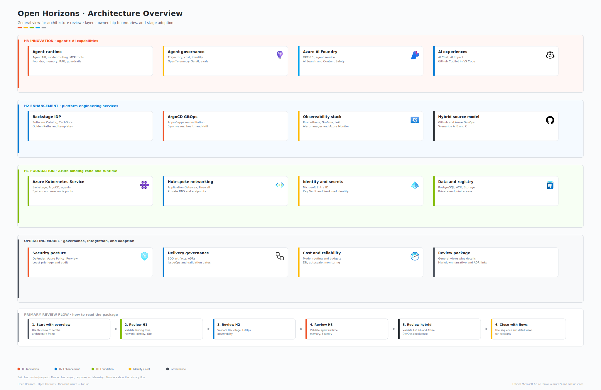
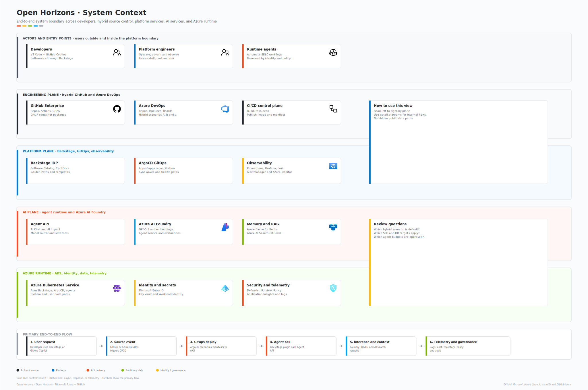
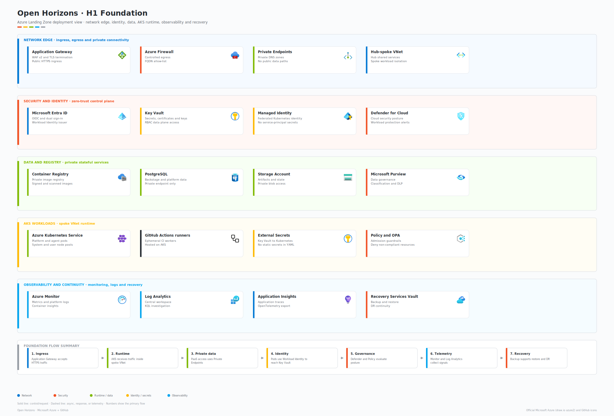
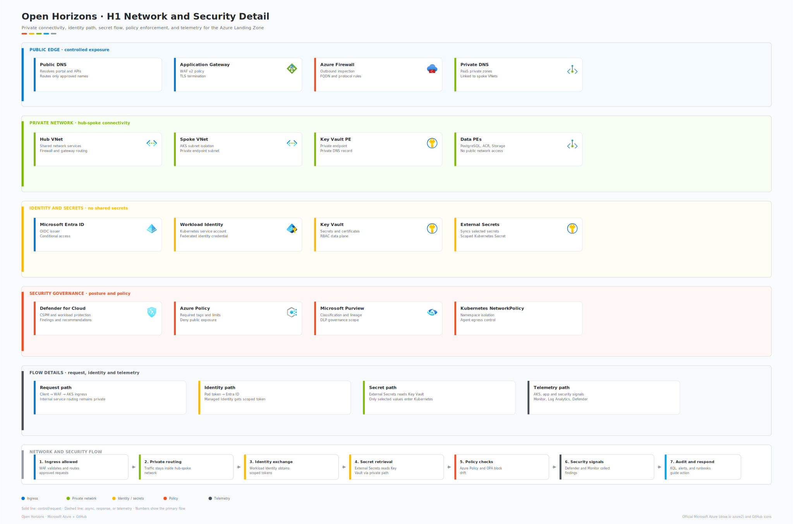
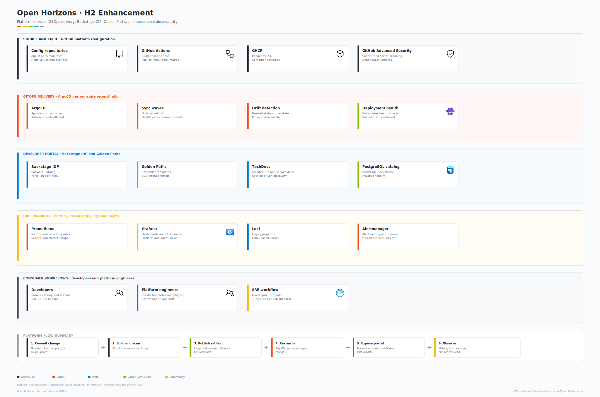
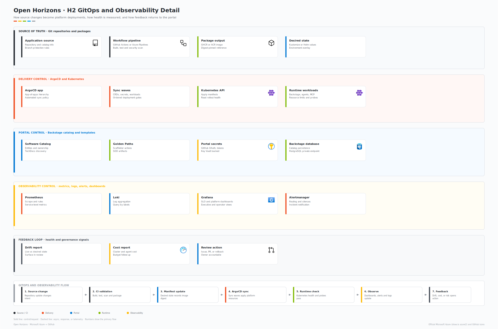
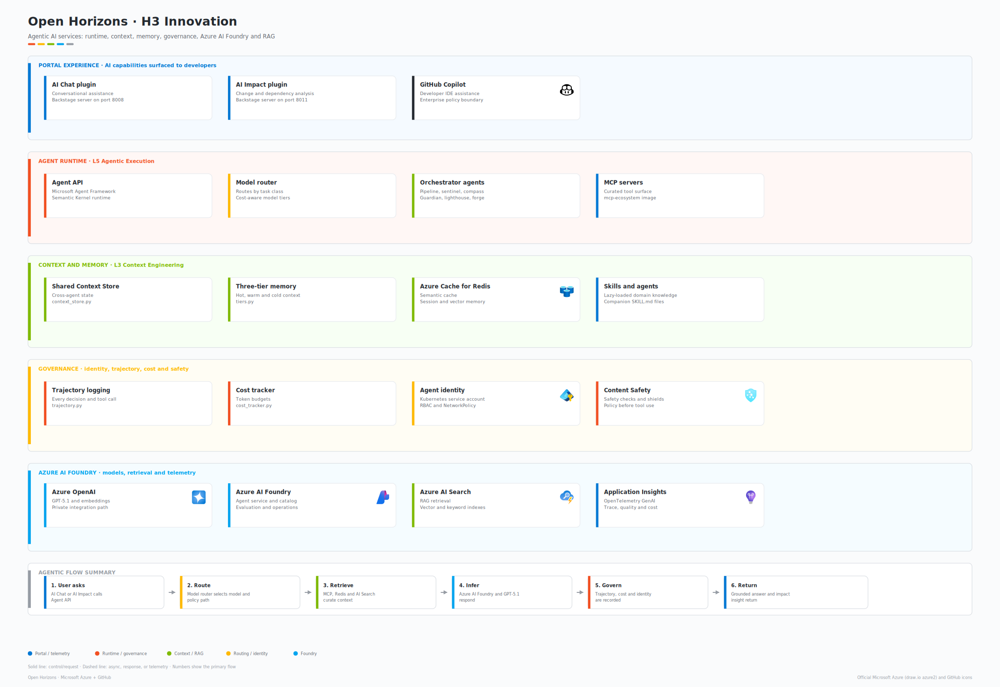
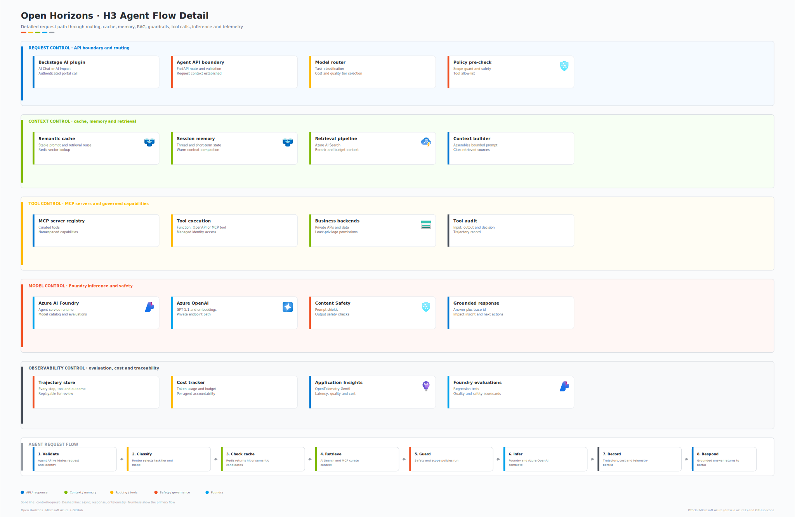
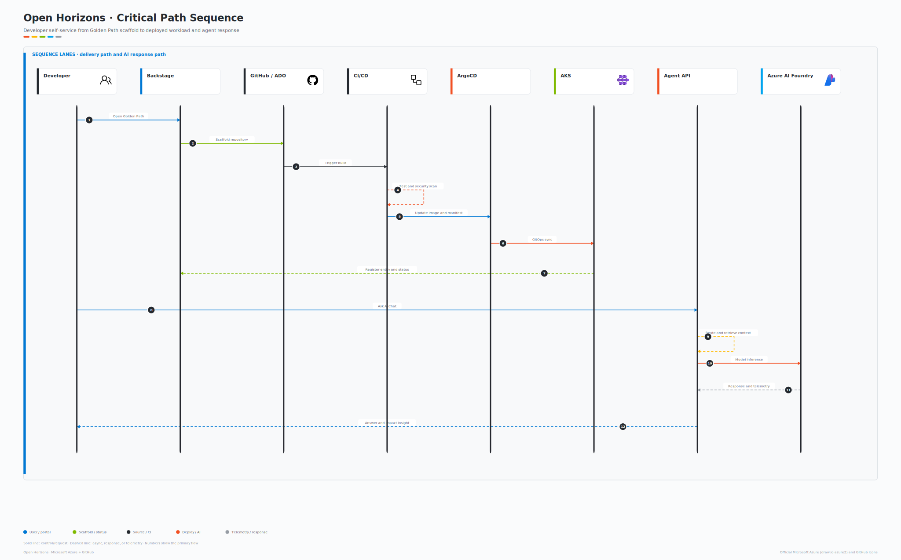

# Open Horizons Architecture Guide

> Architecture guide for architects, tech leads, and platform engineers who need to understand how Open Horizons is structured, why the main architecture decisions were made, and how the official diagram package maps to the implementation.

## Change Log

| Version | Date | Author | Changes |
| ------- | ---- | ------ | ------- |
| 5.0.0 | 2026-06-18 | Open Horizons | Consolidated the guide around the official draw.io architecture package, removed redundant legacy SVG and Mermaid flows, updated H3 to Foundry/L6/GPT-5.1, and aligned diagram usage with the documentation style guide. |
| 4.0.0 | 2026-06-17 | Platform Engineering | Previous architecture guide version. |

## Table of Contents

- [1. Introduction](#1-introduction)
- [2. Architecture Model](#2-architecture-model)
- [3. System Context](#3-system-context)
- [4. H1 Foundation Architecture](#4-h1-foundation-architecture)
- [5. H2 Enhancement Architecture](#5-h2-enhancement-architecture)
- [6. H3 Innovation Architecture](#6-h3-innovation-architecture)
- [7. Critical End-to-End Flow](#7-critical-end-to-end-flow)
- [8. Agent Operating Model](#8-agent-operating-model)
- [9. Architecture Decisions](#9-architecture-decisions)
- [10. Diagram Asset Governance](#10-diagram-asset-governance)
- [References](#references)

## 1. Introduction

Open Horizons is an **Agentic DevOps Platform** deployed on Azure Kubernetes Service (AKS). It provides a single Backstage OSS portal for two personas:

- **Developer IDP**: software catalog, Golden Paths, TechDocs, service ownership, and delivery visibility.
- **Agent IDP**: agent catalog, model routing, context, memory, tool governance, cost, and telemetry.

This guide explains the design of the platform and the purpose of each major component. It complements the [Deployment Guide](DEPLOYMENT_GUIDE.md), which explains how to install and verify the platform.

### 1.1 Audience

| Role | What this guide helps with |
| ---- | -------------------------- |
| Cloud architects | Understand Azure service integration, network boundaries, and deployment stages. |
| Security architects | Review Zero Trust controls, private endpoints, Workload Identity, policy, and secret management. |
| Platform engineers | Understand Backstage, ArgoCD, observability, Golden Paths, and operational workflows. |
| DevOps engineers | Understand GitOps reconciliation, CI/CD integration, and deployment control points. |
| AI platform engineers | Understand Agent API, Foundry gateway, model routing, memory, RAG, tools, and telemetry. |

### 1.2 Diagram Package

The official architecture diagrams live in [docs/assets/architecture](../assets/architecture/). Each diagram has an editable `.drawio` source and an exported `.svg` for Markdown and decks. Legacy standalone SVGs under [docs/assets](../assets/) are not used by this guide.

## 2. Architecture Model

Open Horizons is organized around three adoption stages and five platform layers. The stages make adoption incremental; the layers make ownership and runtime responsibilities explicit.

### 2.1 Adoption Stages

| Stage | Purpose | Primary capabilities |
| ----- | ------- | -------------------- |
| **H1 Foundation** | Secure cloud runtime | AKS, networking, private endpoints, identity, Key Vault, ACR, PostgreSQL, Redis, Defender, and observability foundations. |
| **H2 Enhancement** | Developer and platform services | Backstage OSS, ArgoCD GitOps, Golden Paths, TechDocs, observability stack, policy, and developer self-service. |
| **H3 Innovation** | Agentic AI capabilities | Agent API, Microsoft Agent Framework, Semantic Kernel runtime, context engineering, model routing, MCP tools, Foundry Agents Gateway, memory, RAG, evaluation, and telemetry. |

### 2.2 Platform Layers

| Layer | Repository areas | Responsibility |
| ----- | ---------------- | -------------- |
| **L1 Cloud and Infrastructure** | `terraform/modules/` | Azure foundation, private networking, managed data services, AKS, and core security controls. |
| **L2 Platform Engineering** | `backstage/`, `argocd/`, `policies/`, `golden-paths/`, `grafana/` | Developer portal, GitOps delivery, Golden Paths, policy, dashboards, and day-two operations. |
| **L3 Context Engineering** | `mcp-servers/`, `.github/skills/`, `backstage/server/agent-api/memory/` | Context stores, memory tiers, skills, MCP tools, and retrieval boundaries. |
| **L4 Intent Engineering** | `.github/model-routing.yaml`, `golden-paths/common/templates/`, `CONSTITUTION.md` | Requirements, model routing, SDD artifacts, and workflow intent. |
| **L5 Agentic Execution** | `backstage/server/agent-api*/`, `foundry/`, `.github/agents/` | Runtime agents, tool hooks, trajectory, cost, model calls, and governed agent execution. |

## 3. System Context

The system context view shows how users, source-control systems, platform services, AI services, and Azure runtime services interact across the platform boundary.

### 3.1 Primary Actors and Systems

| Area | Components | Role in the platform |
| ---- | ---------- | -------------------- |
| Users | Developers, platform engineers, runtime agents | Create software, operate the platform, and automate SDLC workflows. |
| Engineering systems | GitHub Enterprise Cloud, Azure DevOps, GitHub Actions, Azure Pipelines | Source, build, scan, package, and trigger delivery workflows. |
| Platform plane | Backstage OSS, ArgoCD, observability stack, policy | Exposes self-service and reconciles desired state to AKS. |
| AI plane | Backstage AI plugins, Agent API, Azure AI Foundry, memory and retrieval services | Provides agentic assistance, model calls, context, and governed automation. |
| Azure runtime | AKS, Key Vault, PostgreSQL, Azure Managed Redis, Cosmos DB, Azure Monitor | Runs workloads and protects stateful services through private access and identity. |

### 3.2 Boundary Rules

- Stateful platform data services use private endpoints where supported.
- Workloads use Workload Identity or managed identity instead of service-principal secrets.
- ArgoCD reconciles platform and application workloads from Git.
- Agent calls flow through a governed Agent API or Foundry gateway boundary before model or tool execution.
- Observability and cost signals are part of the system boundary, not a separate afterthought.

## 4. H1 Foundation Architecture

H1 provides the secure Azure runtime used by every higher layer. It includes AKS, identity, network isolation, secrets, registry, data services, and baseline telemetry.

### 4.1 Core Components

| Component | Azure service or technology | Purpose | Required |
| --------- | --------------------------- | ------- | -------- |
| AKS | Azure Kubernetes Service | Runtime for Backstage, ArgoCD, agents, and platform workloads. | Yes |
| ACR | Azure Container Registry | Private container image storage. | Yes |
| Key Vault | Azure Key Vault | Secrets, keys, and certificates. | Yes |
| Networking | VNet, subnets, NSGs, private endpoints, private DNS | Network isolation and private service access. | Yes |
| Identity | Microsoft Entra ID, managed identities, Workload Identity | Passwordless workload access. | Yes |
| PostgreSQL | Azure Database for PostgreSQL Flexible Server | Backstage and application relational data. | Optional |
| Redis | Azure Managed Redis | Cache, semantic cache, session state, and vector memory when enabled. | Optional |
| Defender | Microsoft Defender for Cloud | Threat detection and cloud security posture. | Recommended |
| Purview | Microsoft Purview | Data classification and governance. | Optional |

### 4.2 Network and Security Detail

The H1 detail view covers private connectivity, Workload Identity, secret flow, policy, network policy, and telemetry in one diagram. It replaces the older separate network, NSG, Zero Trust, Workload Identity, and secret-management SVGs.

### 4.3 AKS Design

| Node pool | Purpose | Why it is separate |
| --------- | ------- | ------------------ |
| System | Kubernetes and platform system components | Keeps system pods isolated from application scheduling pressure. |
| Workload | Application and platform workloads | Scales independently from the system pool. |
| AI | Optional AI or GPU workloads | Can be enabled only for H3 workloads that need specialized compute. |

### 4.4 Cluster Add-ons

| Add-on | Purpose |
| ------ | ------- |
| Azure CNI or CNI Overlay | Integrates pod networking with Azure network design. |
| Azure Policy | Enforces baseline compliance and integrates with Azure governance. |
| Workload Identity | Allows pods to access Azure resources without stored credentials. |
| External Secrets Operator | Syncs Key Vault values into Kubernetes Secrets when needed by workloads. |
| Blob CSI | Allows supported workloads to mount Azure Blob storage. |

## 5. H2 Enhancement Architecture

H2 adds the developer portal, GitOps reconciliation, Golden Paths, observability, and operational workflows on top of the secure H1 runtime.

### 5.1 Core Components

| Component | Technology | Purpose | Required |
| --------- | ---------- | ------- | -------- |
| Backstage OSS | Backstage | Developer portal, software catalog, TechDocs, and Scaffolder. | Recommended |
| ArgoCD | Argo CD | GitOps desired-state reconciliation. | Recommended |
| Golden Paths | Backstage Software Templates | Standard scaffolding for H1, H2, and H3 workload types. | Recommended |
| External Secrets | External Secrets Operator | Key Vault to Kubernetes secret synchronization. | Recommended |
| Policy | OPA Gatekeeper, Azure Policy | Admission and compliance guardrails. | Recommended |
| Observability | Prometheus, Grafana, Loki, Alertmanager, Azure Monitor | Metrics, logs, alerts, dashboards, and health views. | Recommended |
| GitHub runners | GitHub Actions self-hosted runners | Optional private CI/CD execution. | Optional |

### 5.2 GitOps and Observability Detail

The H2 detail view shows how source changes become deployments and how observability feeds the operating model. It replaces the older separate GitOps, ArgoCD hierarchy, observability, metrics, and alert-flow SVGs.

### 5.3 Sync Strategies

| Strategy | Use case | Behavior |
| -------- | -------- | -------- |
| Auto-sync | Development environments | ArgoCD applies changes when Git changes. |
| Manual sync | Production environments | A human approves the sync before deployment. |
| Self-heal | Managed environments | ArgoCD reverts unauthorized live drift. |
| Prune | Cleanup workflows | Resources removed from Git are removed from the cluster. |

## 6. H3 Innovation Architecture

H3 adds governed agentic AI capabilities. It is optional and gated behind H3 adoption flags such as `enable_ai_foundry` and `enable_foundry_agents`.

### 6.1 Core Components

| Component | Implementation area | Purpose |
| --------- | ------------------- | ------- |
| Backstage AI plugins | `backstage/plugins/ai-chat/` | AI Chat and AI Impact experiences in the portal. |
| Agent API | `backstage/server/agent-api*/` | FastAPI services for AI Chat, AI Impact, Microsoft Agent Framework, and Semantic Kernel paths. |
| Runtime agents | `backstage/server/agent-api/` | Orchestrator, pipeline, sentinel, compass, guardian, lighthouse, and forge. |
| MCP tools | `mcp-servers/` | Tool surface for documentation, platform, GitHub, Backstage, and methodology retrieval. |
| Context and memory | `backstage/server/agent-api/memory/` | Shared context store and hot, warm, cold memory tiers. |
| Tool hooks | `backstage/server/agent-api/middleware/hooks.py` | Pre and post tool-use governance for every runtime tool call. |
| Foundry Agents Gateway | `foundry/agents-service/` | H3/L6 gateway in front of Azure AI Foundry with cache, A2A routing, hooks, memory, and telemetry. |
| Azure AI Foundry | Terraform `ai-foundry` module | GPT-5.1, embeddings, Azure AI Search, Content Safety, evaluation, and model operations. |
| Enterprise memory | Cosmos DB and Azure Managed Redis | Long-term memory, semantic cache, vector search, and session state where enabled. |
| Telemetry | Application Insights, Azure Monitor, OpenTelemetry GenAI | Per-call traceability, cost, latency, model tier, and governance telemetry. |

### 6.2 Agent Request Flow

The H3 detail view covers request validation, routing, semantic cache, memory, RAG, guardrails, tool calls, Foundry inference, evaluation, cost, and telemetry. It replaces the older agent-category and AI Foundry SVGs.

### 6.3 Model Routing

Open Horizons routes SDLC tasks by phase and cost tier. The source of truth is the [model routing configuration](../../.github/model-routing.yaml).

| SDLC phase | Task | Recommended models | Extended thinking | Cost tier |
| ---------- | ---- | ------------------ | ----------------- | --------- |
| Specification | Vague requirements to structured specs | Claude Opus 4.6, GPT-5.1 | Yes | High |
| Architecture | Planning affecting more than five files | Claude Opus 4.6, GPT-5.1 | Yes | High |
| TDD spec | Test cases from clear specification | Claude Sonnet 4.6, GPT-5.1 | No | Medium |
| Implementation | Feature code across scoped files | Claude Sonnet 4.6, GPT-5.1 | No | Medium |
| Docstrings | Docstrings, commit messages, changelogs | Claude Haiku 4.5, GPT-5.1 | No | Low |
| Code review | Quality and security review | Claude Opus 4.6, GPT-5.1 | Yes | High |
| Summarization | PR descriptions and release notes | Claude Haiku 4.5, GPT-5.1 | No | Low |

## 7. Critical End-to-End Flow

The critical path diagram shows how a developer moves from self-service scaffolding to GitOps deployment and agent response. It replaces the older standalone deployment-flow and secret-access diagrams in this guide.

### 7.1 Flow Summary

1. A developer uses Backstage or GitHub to start a Golden Path workflow.
2. The template emits code, SDD artifacts, CI/CD workflow files, and Kubernetes or Terraform manifests.
3. GitHub Actions or Azure Pipelines builds, tests, scans, and publishes artifacts.
4. ArgoCD reconciles the desired state into AKS.
5. Workloads use Workload Identity and private endpoints for secrets and data access.
6. Observability, cost, and drift signals flow back to dashboards and the portal.
7. AI Chat or AI Impact requests flow through Agent API or the Foundry gateway for context, tools, model calls, and telemetry.

## 8. Agent Operating Model

Open Horizons has two agent layers: deploy-managed GitHub Copilot Chat agents for platform operations and runtime agents inside the AI Chat service.

### 8.1 Deploy-Managed GitHub Copilot Chat Agents

| Agent | Responsibility |
| ----- | -------------- |
| `@deploy` | Coordinates end-to-end platform deployment and validation. |
| `@terraform` | Authors and validates Terraform modules and plans. |
| `@azure-portal-deploy` | Provisions Azure portal infrastructure paths such as AKS, Key Vault, ACR, and PostgreSQL. |
| `@backstage-expert` | Deploys and configures Backstage OSS, auth, Golden Paths, and TechDocs. |
| `@github-integration` | Configures GitHub App, org discovery, GHAS, Actions, and Packages. |
| `@ado-integration` | Configures Azure DevOps PAT, repos, pipelines, and boards integration. |
| `@hybrid-scenarios` | Designs and implements GitHub plus Azure DevOps coexistence scenarios. |
| `@security` | Reviews Zero Trust, RBAC, secrets, vulnerabilities, and policy. |
| `@sre` | Reviews observability, SLOs, incident response, and day-two operations. |

### 8.2 Runtime Agents

| Runtime agent | Role |
| ------------- | ---- |
| orchestrator | Default fallback and request router. |
| pipeline | CI/CD diagnostics. |
| sentinel | Test coverage and quality gates. |
| compass | Sprint planning and story creation. |
| guardian | Security scanning and advisories. |
| lighthouse | SRE, monitoring, and deployment health. |
| forge | Infrastructure and repository automation. |

### 8.3 Tool Governance

All runtime tool calls pass through a common pre and post hook path. The pre-hook classifies tools, blocks dangerous arguments, and audits decisions. The post-hook redacts secrets and truncates oversized results before they return to the model.

## 9. Architecture Decisions

### 9.1 ADR-001: Use AKS for Container Runtime

**Status:** Accepted

Open Horizons uses AKS instead of self-managed Kubernetes to reduce control-plane operational overhead and improve integration with Azure identity, networking, monitoring, and policy.

### 9.2 ADR-002: Use ArgoCD for GitOps

**Status:** Accepted

Open Horizons uses ArgoCD because its application-centric reconciliation model, health checks, sync waves, and UI fit the platform's developer and operator workflows.

### 9.3 ADR-003: Use Azure CNI or CNI Overlay

**Status:** Accepted

AKS networking is configured to integrate workloads with Azure network policy, subnet planning, and private service access. The exact CNI mode is chosen per environment sizing profile.

### 9.4 ADR-004: Use External Secrets Operator

**Status:** Accepted

External Secrets Operator syncs Key Vault values into Kubernetes Secrets when applications need standard Kubernetes secret objects, while keeping source-of-truth secrets in Key Vault.

### 9.5 ADR-005: Use the Foundry Agents Gateway as the H3/L6 Harness

**Status:** Accepted

The Foundry gateway is implemented as a standalone service under `foundry/`. It fronts Azure AI Foundry and centralizes semantic cache, A2A routing, tool hooks, Cosmos memory, Purview audit, and 21-field LLM telemetry.

See [ADR-0002: Foundry agents gateway as the L6 harness service](../architecture/adr/0002-foundry-agents-gateway-l6-harness.md).

## 10. Diagram Asset Governance

The architecture diagrams embedded in this guide follow the [Documentation Style Guide](DOCUMENTATION_STYLE_GUIDE.md). Use these rules when adding or changing diagrams:

- Store editable `.drawio` and exported `.svg` files together under [docs/assets/architecture](../assets/architecture/).
- Use official Azure, Microsoft, and GitHub icons for architecture diagrams.
- Do not embed both a legacy SVG and a Mermaid diagram for the same flow.
- Keep overview diagrams broad and move detailed flow into detail diagrams.
- Prefer a single official diagram per section unless a second diagram adds a different level of detail.
- Remove unused legacy image files after all references have moved to the official package.

## Summary

Open Horizons is a three-stage Agentic DevOps Platform. H1 builds the secure Azure foundation. H2 adds the developer portal, GitOps, Golden Paths, and observability. H3 adds governed agentic AI through Agent API services, MCP tools, memory, model routing, the Foundry gateway, and OpenTelemetry-backed telemetry.

For deployment details, see the [Deployment Guide](DEPLOYMENT_GUIDE.md). For a review-board package with all diagram walkthroughs, see [Open Horizons Technical Architecture Review](../architecture/ARCHITECTURE_REVIEW.md).

## Using GitHub Copilot Agents for Architecture

| Task | Agent | Example prompt |
| ---- | ----- | -------------- |
| System design | `@deploy` | "Plan the platform deployment architecture for this environment" |
| Well-Architected review | `@security` | "Evaluate this design against Zero Trust and baseline security requirements" |
| Module structure | `@terraform` | "Help decompose this into reusable Terraform modules" |
| Security review | `@security` | "Review this architecture for Zero Trust compliance" |
| Deployment decision record | `@deploy` | "Summarize the deployment decision and required follow-up actions" |

Start with `@deploy` for architecture-impacting platform work. It can coordinate with `@terraform`, `@azure-portal-deploy`, `@backstage-expert`, `@security`, and `@sre` as needed.

## Related Documentation

| Document | Description |
| -------- | ----------- |
| [Deployment Guide](DEPLOYMENT_GUIDE.md) | Step-by-step platform deployment instructions. |
| [Module Reference](MODULE_REFERENCE.md) | Inputs, outputs, and examples for Terraform modules. |
| [Documentation Style Guide](DOCUMENTATION_STYLE_GUIDE.md) | Editorial and diagram standards. |
| [Technical Architecture Review](../architecture/ARCHITECTURE_REVIEW.md) | Review-board diagram package and walkthrough. |
| [Open Horizons Architecture](../architecture/OpenHorizons_Architecture.md) | Mermaid-based architecture document. |

## Next Steps

- Deploy the platform with the [Deployment Guide](DEPLOYMENT_GUIDE.md).
- Review module-level configuration in the [Module Reference](MODULE_REFERENCE.md).
- Use the [Technical Architecture Review](../architecture/ARCHITECTURE_REVIEW.md) for architecture-board discussions.

## References

- [Azure Well-Architected Framework](https://learn.microsoft.com/azure/well-architected/)
- [AKS baseline reference architecture](https://learn.microsoft.com/azure/architecture/reference-architectures/containers/aks/baseline-aks)
- [Azure Zero Trust guidance](https://learn.microsoft.com/security/zero-trust/)
- [Microsoft Entra Workload ID on AKS](https://learn.microsoft.com/azure/aks/workload-identity-overview)
- [Azure AI Foundry documentation](https://learn.microsoft.com/azure/ai-foundry/)
- [Azure architecture icons](https://learn.microsoft.com/azure/architecture/icons/)
- [GitHub Octicons](https://primer.style/octicons/)
- [Argo CD documentation](https://argo-cd.readthedocs.io/)
- [OpenTelemetry GenAI semantic conventions](https://opentelemetry.io/docs/specs/semconv/gen-ai/)

---

<table>
<tr>
<td align="left">

</td>
<td align="center">

</td>
<td align="right">

</td>
</tr>
</table>

