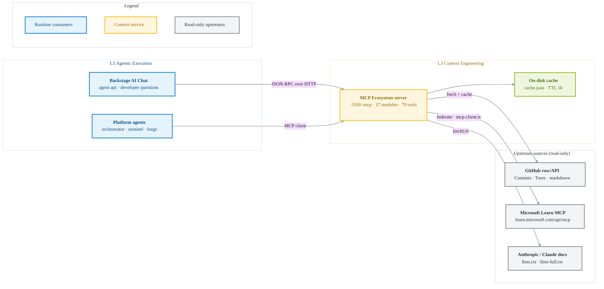
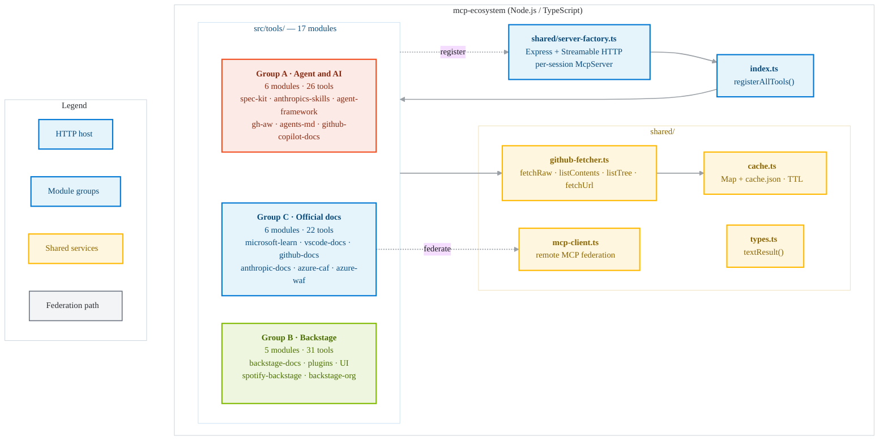
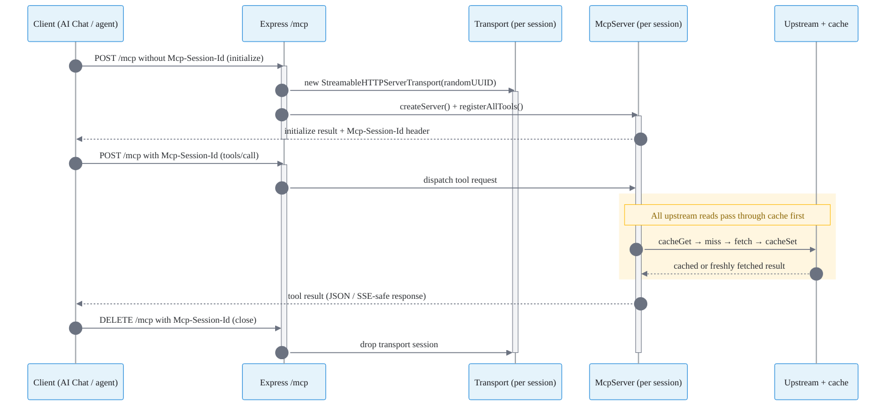
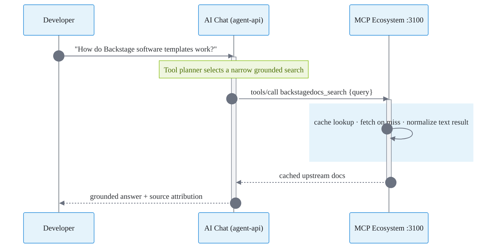
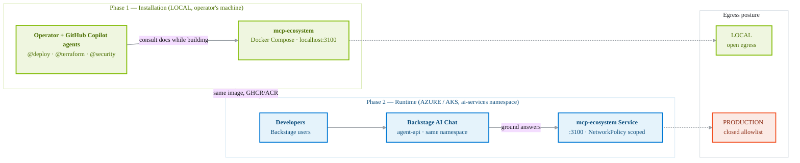

# MCP Ecosystem — Architecture

> Status: current · Scope: `mcp-servers/` · Layer: **L3 Context Engineering**
> Companion skill: [mcp-ecosystem skill](../.github/skills/mcp-ecosystem/SKILL.md)

The **MCP Ecosystem** is Open Horizons' own [Model Context Protocol](https://modelcontextprotocol.io)
server. It exposes **79 tools across 17 modules** that fetch live, cached
reference data — methodology, format specs, templates, UI components, plugin
catalogs, and **complete official documentation** — from curated upstream
sources. Beyond methodology and Backstage references, it federates **Microsoft
Learn** (all of Azure / AKS / AI Foundry / CAF / WAF), and scrapes **VS Code**,
**GitHub**, and **Anthropic / Claude** docs. It is the runtime that lets platform
agents and the Backstage **AI Chat** ground answers in real, current upstream
documentation instead of relying on model recall.


> Editable source: [`docs/assets/mcp-ecosystem-architecture.drawio`](../docs/assets/mcp-ecosystem-architecture.drawio)
> (draw.io, official Azure / GitHub icons). The Mermaid diagrams below detail each subsystem.

---

## 1. Where it fits



**Two distinct MCP surfaces** (do not conflate):

| Surface | What it is | File |
| --- | --- | --- |
| **MCP Ecosystem** (this doc) | *Implemented* server serving documentation/reference tools | [mcp-servers/](.) |
| **Infra MCP policy** | *Access policy* mapping runtime agents → operational MCP servers (`azure`, `github`, `terraform`, `kubernetes`, …) | [mcp-config.json](mcp-config.json) |

---

## 2. Component architecture



- **`src/index.ts`** — composition root. `registerAllTools(server)` wires every
  module's `register<Name>Tools(server)` in three groups (A: agent/AI frameworks,
  B: Backstage ecosystem, C: official documentation).
- **`src/shared/server-factory.ts`** — builds an `McpServer` (`mcp-ecosystem`
  v1.0.0, capabilities: tools/prompts/resources) and runs the Express HTTP host.
- **`src/shared/`** — cross-cutting cache, GitHub fetchers, and types.
- **`src/tools/<module>.ts`** — one file per module; each registers N tools via
  `server.tool(name, description, schema, handler)`.

---

## 3. Transport & session model

The server speaks **MCP over Streamable HTTP** (`StreamableHTTPServerTransport`)
on a single `/mcp` endpoint, with per-session isolation.



| Route | Purpose |
| --- | --- |
| `POST /mcp` | Initialize a session (no `Mcp-Session-Id`) or send a request (with id). Unknown id → `404`. |
| `GET /mcp` | Server-to-client stream for an active session (`400` if none). |
| `DELETE /mcp` | Tear down a session. |
| `GET /health` | `{ "status": "ok", "sessions": N }` — used by container/K8s probes. |

Each session gets a **fresh `McpServer` instance** to avoid "Already connected"
errors; transports are tracked in a `Map` and removed on `onclose`/`DELETE`.
`uncaughtException`/`unhandledRejection` handlers keep the process alive.

---

## 4. Data layer — fetch & cache

All upstream reads go through `shared/github-fetcher.ts` and are cached by
`shared/cache.ts`:

- **`fetchRaw(owner, repo, path, branch)`** → `raw.githubusercontent.com`.
- **`listContents(owner, repo, path, branch)`** → GitHub Contents API.
- **`listTree(owner, repo, branch, prefix)`** → Git Trees API (recursive, one call).
- **`fetchUrl(url)`** → arbitrary HTTPS GET (e.g. `docs.claude.com/llms.txt`).

Group C's `microsoft-learn` module additionally **federates** a remote MCP server
via `shared/mcp-client.ts` (`callRemoteMcpTool`): it performs the initialize →
`Mcp-Session-Id` → `notifications/initialized` → `tools/call` handshake against
`MSLEARN_MCP_URL` (default `https://learn.microsoft.com/api/mcp`) and handles both
JSON and SSE responses.

Cache characteristics:

- **Write-through**: in-memory `Map` + persisted to `${CACHE_DIR}/cache.json`.
- **TTL**: `CACHE_TTL_MS` (default `3600000` = 1h); expired entries are skipped
  on read and pruned on load.
- **Durable**: cache survives restarts (loaded on startup); corrupt files are
  discarded and repopulated.
- **Resilient**: cache write failures are non-fatal.
- **Auth**: optional `GH_TOKEN` (Bearer) raises GitHub raw/API rate limits.

---

## 5. Tool catalog (17 modules · 79 tools)

### Group A — Agent & AI frameworks (6 modules · 26 tools)

| Module | Prefix | Count | Tools |
| --- | --- | --- | --- |
| spec-kit | `speckit_` | 5 | `get_phases`, `get_commands`, `get_methodology`, `get_philosophy`, `search` |
| anthropics-skills | `anthropics_` | 5 | `list_skills`, `get_skill`, `get_skill_template`, `search_skills`, `get_spec` |
| agent-framework | `agentfw_` | 4 | `get_patterns`, `get_sample`, `search_docs`, `get_declarative_agents` |
| gh-aw | `ghaw_` | 4 | `get_workflow_patterns`, `get_security_guidelines`, `get_contributing`, `get_agents_md` |
| agents-md | `agentsmd_` | 3 | `get_format_spec`, `get_readme`, `get_section_templates` |
| `github-copilot-docs` | `copilotdocs_` | 5 | `list_sections`, `get_page`, `search`, `get_customization`, `get_extensions` |

### Group B — Backstage ecosystem (5 modules · 31 tools)

| Module | Prefix | Count | Tools |
| --- | --- | --- | --- |
| `backstage-docs` | `backstagedocs_` | 7 | `list_sections`, `get_page`, `search`, `get_catalog`, `get_software_templates`, `get_plugins`, `get_api_reference` |
| `backstage-plugins` | `backstageplugins_` | 6 | `list_directory`, `list_community`, `get_community_plugin`, `search_community`, `list_core`, `get_core_plugin` |
| `backstage-ui` | `backstageui_` | 8 | `list_components`, `get_component`, `get_api_report`, `get_readme`, `get_changelog`, `storybook_list_stories`, `storybook_get_story`, `storybook_search` |
| `spotify-backstage` | `spotifybackstage_` | 6 | `list_sections`, `get_page`, `get_portal_docs`, `get_plugins_docs`, `get_core_features`, `discover_links` |
| `backstage-org` | `backstageorg_` | 4 | `list_repos`, `get_repo_readme`, `search_repos`, `get_backstage_plugins` |

### Group C — Official documentation (6 modules · 22 tools)

| Module | Prefix | Count | Tools |
| --- | --- | --- | --- |
| `microsoft-learn` | `mslearn_` | 3 | `search`, `code_search`, `fetch` — federated via Microsoft Learn MCP (Azure / AKS / AI Foundry / CAF / WAF) |
| `vscode-docs` | `vscode_` | 4 | `list_sections`, `get_page`, `search`, `get_copilot` |
| `github-docs` | `ghdocs_` | 4 | `list_sections`, `list_pages`, `get_page`, `search` |
| `anthropic-docs` | `anthropicdocs_` | 3 | `index`, `get_page`, `search` |
| `azure-caf` | `caf_` | 4 | `list_sections`, `get_page`, `search`, `get_methodology` |
| `azure-waf` | `waf_` | 4 | `list_pillars`, `get_pillar`, `get_page`, `search` |

Full tool name = `prefix + suffix`, e.g. `speckit_get_phases`,
`backstageui_storybook_search`.

---

## 6. AI Chat integration

The Backstage **AI Chat** (agent-api) connects through a thin Python client and
advertises a curated subset of tools to the model.

- **Client**: [agent-api MCP Ecosystem client](../backstage/server/agent-api/tools/mcp_ecosystem.py)
- **Target URL**: `MCP_ECOSYSTEM_URL` (default `http://localhost:3100/mcp`;
  in-cluster → the `mcp-ecosystem` Service).
- **Advertised tools** (orchestrator, sentinel, lighthouse, guardian, forge, pipeline):

| Model-facing tool | Maps to ecosystem tool |
| --- | --- |
| `ecosystem_list_tools` | `tools/list` (discovery) |
| `ecosystem_call_tool(name, args)` | any of the 79 tools |
| `search_backstage_docs(query)` | `backstagedocs_search` |
| `get_spec_kit_methodology()` | `speckit_get_methodology` |
| `search_copilot_docs(query)` | `copilotdocs_search` |
| `search_anthropic_docs(query)` | `anthropicdocs_search` |
| `search_microsoft_learn(query)` | `mslearn_search` (federated) |
| `fetch_microsoft_learn(url)` | `mslearn_fetch` |
| `search_vscode_docs(query, section)` | `vscode_search` |
| `search_github_docs(query, section)` | `ghdocs_search` |
| `search_caf(query, section)` | `caf_search` |
| `search_waf(query, section)` | `waf_search` |

If the server is unreachable, the client **degrades gracefully** — the chat
answers without grounding rather than failing the request.



---

## 7. Deployment & lifecycle

The MCP Ecosystem has **two distinct roles** in the platform lifecycle. The same
server image is used in both, but for different audiences.



| | Phase 1 — Installation | Phase 2 — Runtime |
| --- | --- | --- |
| Where | **Local** (operator's machine, Docker) | **Azure / AKS** (`ai-services` namespace) |
| Who uses it | The operator and the Copilot agents while **building** the platform | The **AI Chat** that developers use inside Backstage |
| Why | Ground build-time decisions in real upstream docs (spec-kit, Backstage, …) | Ground developer answers in real upstream docs |
| How started | `docker compose up` (or `make up`) | `Deployment` + `Service` rendered by the installer, gated to `enable_mcp_ecosystem` |
| Lifecycle | Ephemeral, on the laptop; never shipped to Azure | Long-running, governed, observable |

> The **infra/operational MCP servers** (`azure`, `github`, `terraform`,
> `kubernetes`, …) in [mcp-config.json](mcp-config.json) are a **different**
> surface used only locally during installation to actually execute changes.
> They are not part of this server and are never deployed to AKS.

### 7.1 Local (Docker Compose) — used during installation

```bash
cd mcp-servers
make up      # docker compose up -d --build  → :3100
make health  # curl http://localhost:3100/health  → {"status":"ok"}
make logs
make down
```

`docker-compose.yml`: `restart: unless-stopped`, a named volume for `CACHE_DIR`,
and optional `GH_TOKEN`/`CACHE_TTL_MS`. The `.env` file is **optional**
(`required: false`) so the server runs with zero configuration.

The host port is configurable to avoid local collisions (Grafana **Loki** also
defaults to `3100`):

```bash
MCP_ECOSYSTEM_PORT=3101 docker compose up -d   # serve on host :3101
```

### 7.2 Container image

Published to GHCR as `ghcr.io/ohorizons/mcp-ecosystem` (multi-stage Node build;
see [Dockerfile](Dockerfile) and the platform CHANGELOG for the current tag).
Never use `:latest` in manifests.

### 7.3 Kubernetes / AKS — used at runtime

Rendered by the installer (`scripts/render-k8s.sh` → `scripts/render-manifests.sh`)
and gated to `enable_mcp_ecosystem` (wizard `RULE-003`):

- **Namespace**: `ai-services` — the **same namespace as the AI Chat agent-api**,
  so the call is in-namespace (no cross-namespace hop).
- **Workloads**: [mcp-ecosystem-deployment.yaml.tmpl](../backstage/k8s/templates/mcp-ecosystem-deployment.yaml.tmpl)
  renders a `Deployment` + `Service` + `ServiceAccount` on port `3100`, with
  `GET /health` liveness/readiness probes and `automountServiceAccountToken: false`.
- **NetworkPolicy**: [mcp-ecosystem-networkpolicy.yaml.tmpl](../backstage/k8s/templates/mcp-ecosystem-networkpolicy.yaml.tmpl)
  locks ingress on `:3100` to the `agent-api` pod (the only consumer); egress
  stays open so the server can fetch and cache upstream docs.
- **Wiring**: the AI Chat agent-api sets `MCP_ECOSYSTEM_URL` explicitly to
  `http://mcp-ecosystem.ai-services.svc.cluster.local:3100/mcp` in
  [agent-api-deployment.yaml.tmpl](../backstage/k8s/templates/agent-api-deployment.yaml.tmpl).
- **Cache**: mount a `PersistentVolumeClaim` at `CACHE_DIR` to persist the cache
  across restarts; inject optional `GH_TOKEN` from Key Vault via CSI.

### 7.4 Using your own ACR instead of GHCR

The manifests default to the public GHCR image. To pull from a private **Azure
Container Registry**, import the image once and point the installer at it:

```bash
# 1. Import the public image into your ACR (one-time, per version tag)
az acr import \
  --name <your-acr> \
  --source ghcr.io/ohorizons/mcp-ecosystem:<tag> \
  --image mcp-ecosystem:<tag>

# 2. Tell the installer to render the ACR path (consumed by render-manifests.sh)
export MCP_ECOSYSTEM_IMAGE="<your-acr>.azurecr.io/mcp-ecosystem:<tag>"
scripts/render-k8s.sh && scripts/render-manifests.sh
```

The AKS kubelet pulls from ACR using the cluster's `AcrPull` managed identity
(configured by the `aks-cluster` + `container-registry` Terraform modules), so
no registry secret is needed in the pod.

---

## 8. Configuration

| Variable | Default | Purpose |
| --- | --- | --- |
| `PORT` | `3100` | HTTP listen port (in-container) |
| `CACHE_DIR` | `<cwd>/cache` | Cache directory (mount a volume) |
| `CACHE_TTL_MS` | `3600000` | Cache TTL (1 hour) |
| `GH_TOKEN` | (empty) | Optional GitHub token to raise upstream rate limits |
| `MCP_ECOSYSTEM_PORT` | `3100` | **Local only** host port for docker compose (avoid Loki clash) |
| `MCP_ECOSYSTEM_IMAGE` | `ghcr.io/ohorizons/mcp-ecosystem` | **Installer** image path (override for ACR) |
| `MCP_ECOSYSTEM_URL` | local: `http://localhost:3100/mcp` · AKS: `http://mcp-ecosystem.ai-services.svc.cluster.local:3100/mcp` | **Client-side** (agent-api) target URL |

---

## 9. Security

- **Read-only**: the server only performs `GET` reads against public upstream
  sources; it holds no write credentials and mutates no external state.
- **Secrets**: `GH_TOKEN` is optional and injected via env/Key Vault, never
  committed. It is a low-privilege read token.
- **Network egress**: only `raw.githubusercontent.com` and `api.github.com`.
- **Network ingress (AKS)**: a `NetworkPolicy` restricts `:3100` to the
  `agent-api` pod in `ai-services`; no other workload can reach the server.
- **Tenancy**: per-session transports isolate concurrent clients; unknown
  session ids are rejected (`404`).
- **Resilience**: global exception handlers prevent crashes; cache failures and
  upstream errors are contained per request.
- **Supply chain**: pin the GHCR tag; scan the image (Trivy) in CI.

---

## 10. Observability

- **Health/readiness**: `GET /health` → `{ status, sessions }`.
- **Logs**: structured `[mcp-ecosystem]` prefixed stderr for transport/handler
  errors and lifecycle events.
- **Capacity signal**: `sessions` count surfaces active client load.

---

## 11. Extending the server

1. Create `src/tools/<module>.ts` exporting
   `register<Module>Tools(server: McpServer)`; register tools with
   `server.tool(name, description, zodSchema, handler)`.
2. Fetch upstream via `shared/github-fetcher.ts`; never bypass the cache.
3. Wire it into `src/index.ts` `registerAllTools()` under Group A, B, or C.
4. **Keep counts in sync** across: this file, [README.md](README.md), the
   [mcp-ecosystem skill](../.github/skills/mcp-ecosystem/SKILL.md),
   and the platform docs.
5. If the AI Chat should expose it, add a convenience wrapper + advertise it in
   the relevant agents under `backstage/server/agent-api/`.

---

## 12. References

- Source: [mcp-servers/](.) · [src/index.ts](src/index.ts) · [src/shared/server-factory.ts](src/shared/server-factory.ts)
- Server README: [README.md](README.md) · Usage: [USAGE.md](USAGE.md)
- Skill: [mcp-ecosystem skill](../.github/skills/mcp-ecosystem/SKILL.md)
- AI Chat client: [agent-api MCP Ecosystem client](../backstage/server/agent-api/tools/mcp_ecosystem.py)
- Model Context Protocol: <https://modelcontextprotocol.io>
